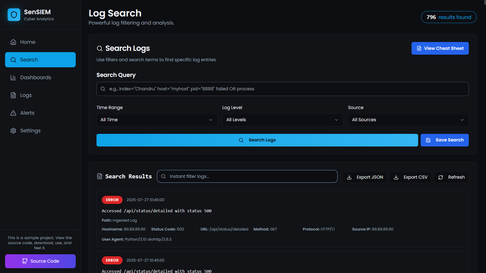
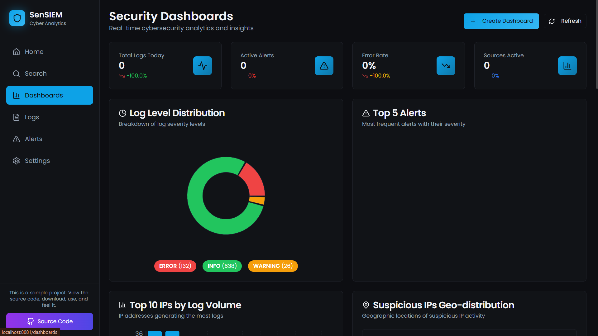
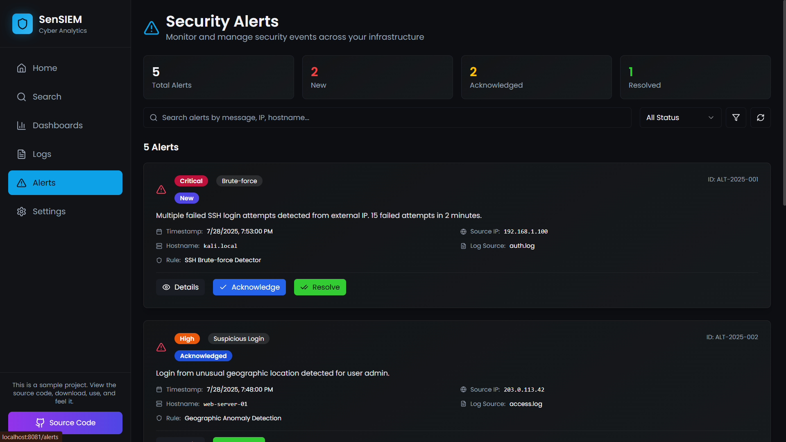

<h1 align="center">

  <strong><b>👁 SenSIEM</b></strong>
</h1>

<h3 align="center">
  <sub><b>Security Event Notification & SIEM Platform</b></sub>
</h3>

  
<p align="center">
  
  
  
</p>

---

> ⚠️ **Work in Progress:**  
> ✅ Core modules are working (log analysis, dashboards, alerts, notifications).  
> 🧠 Final steps: rule editor, UX polish, documentation cleanup.  
> 🎯 Ideal for cybersecurity students and aspiring SOC analysts.

---

## 🛡️ What is SenSIEM?

**SenSIEM** (Sentinel + SIEM) is a modular, real-time Security Information and Event Management (SIEM) platform built for:

- 🔍 **Log analysis and search with filters**
- ⚠️ **Intrusion detection and alerting**
- 📊 **Interactive dashboards and trends**
- 💬 **Multi-channel alert notifications**

This project is **portfolio-ready** and simulates a mini-SOC environment — perfect for blue-team enthusiasts, analysts, and learners.

---

## ✨ Features at a Glance

| Feature                        | Description                                                                 |
|-------------------------------|-----------------------------------------------------------------------------|
| 🔥 Real-time detection         | Monitor logs continuously for anomalies                                     |
| 🔎 Splunk-like filters         | `log_level=`, `source=`, `host=`, and full-text search                      |
| 📊 Dashboards                 | Top IPs, alert trends, log breakdowns                                      |
| 📩 Notifications              | Send alerts via **Email**, **Slack**, and **Telegram**                      |
| 📁 Log Ingestion              | Add file or folder paths interactively                                     |
| ⚙️ Settings Panel             | Control server IP, backup config, toggle modules                           |
| 🛠️ Built with                | **FastAPI**, **React + Tailwind**, **SQLite/PostgreSQL**                   |

---

## 🚀 Quick Start

```bash
# Clone the project
git clone https://github.com/chandruthehacker/Sensiem.git
cd Sensiem

# Setup Backend (FastAPI)
cd backend
pip install -r requirements.txt
python run.py

# Setup Frontend (Next.js + Tailwind)
cd ../frontend
npm install
npm run dev
```

## 🖥️ Full System Overview

---

### 🔎 Search Logs (Powerful Filtering)



_Advanced log search with field-based filtering and keyword matching._

You can filter logs using flexible query syntax like:

- `from_host="192.168.1.10" log_level=error`
- `source="apache"` or `process="sshd"`
- Any keyword like `unauthorized`, `bruteforce`, `aborted`

---

### 📊 Dashboards (Visual Insights)



_Track threats, IPs, alerts, and system health in real-time._

Includes:

- Top IPs generating traffic
- Log level pie charts
- Alert trends over time
- Suspicious login patterns

---

### 📄 Logs Page (Full Log Viewer)


_Chronological stream of all log entries with expandable details._

Features:

- View all raw logs as they arrive
- Click to expand log metadata (IP, source, timestamp, etc.)
- Color-coded by severity level

---

### 🚨 Alerts Page (Detection Engine)



_Triggered alerts based on real-time detection rules._

- Shows detected anomalies such as:
  - Brute-force attempts
  - Failed logins
  - Port scans
- Auto-classified by severity:
  - 🔴 Critical
  - 🟠 High
  - 🟡 Medium
  - 🟢 Low
- Auto-refresh and sorted by latest alerts

---

### ⚙️ Settings Page (Control Panel)


_Manage paths, server IPs, alert settings and backups._

- 🔌 Add or remove log folders/files to monitor
- 🌐 Update destination server IP/port
- 🔔 Enable or test notifications (Slack, Telegram, Email)
- 💾 Backup or restore configuration settings

---

## 📦 Architecture Overview

+--------------------+ +------------------------+
| Log Forwarder |-----> | FastAPI Backend |
| (Python) | | - Ingest & Parse |
+--------------------+ | - Alert Engine |
| - API for Frontend |
+-----------+------------+
|
+----------v----------+
| React Frontend |
| - Dashboards |
| - Search & Logs |
| - Alert Panel |
+----------------------+

---

## 📽️ Demo (Coming Soon...)

🎥 Want to see it in action? Stay tuned for a YouTube demo and deployment tutorial!

---

## 🧠 Ideal For

- ✅ SOC Analyst Portfolio Projects  
- 🔐 Red/Blue Team Tooling  
- 📝 Log Analysis Learning  
- 🏠 Customizable Home-Lab SIEM Deployments

---

## 📄 License

This project is licensed under the **MIT License**.  
See the [LICENSE](LICENSE) file for details.

---

## 🤝 Contributing

Pull requests, feedback, and feature suggestions are welcome!  
Let’s build a powerful open-source SIEM together.

---

## 🙌 Acknowledgements

Big thanks to:

- 🧬 The **FastAPI** and **React** communities  
- 📚 Cybersecurity writeups and bloggers  
- 💖 Everyone contributing to open-source tech
